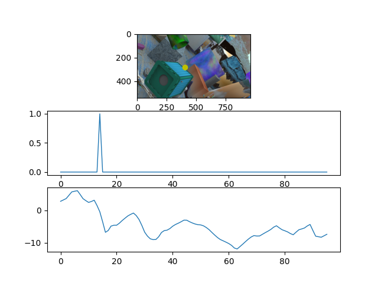

# A tool to visualization Probability distribution
## For CDN
You can easily visualization the offset volume and probability distribution  

**Requirements:**  

**1.cost volume(H,W,D)**  

**2.offset volume(H,W,D)**  

**3.img to vis**   

```
python cost_offset_gui.py
```

You can get demo like this:  

